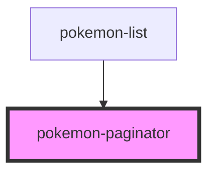

# list-pagination

<!-- Auto Generated Below -->

## Properties

| Property       | Attribute        | Description | Type     | Default     |
| -------------- | ---------------- | ----------- | -------- | ----------- |
| `count`        | `count`          |             | `number` | `undefined` |
| `itemsPerPage` | `items-per-page` |             | `number` | `undefined` |
| `offset`       | `offset`         |             | `number` | `undefined` |

## Events

| Event    | Description | Type                               |
| -------- | ----------- | ---------------------------------- |
| `paging` |             | `CustomEvent<{ offset: number; }>` |

## Dependencies

### Used by

 - [pokemon-list](../pokemon-list)

### Graph

----------------------------------------------

*Built with [StencilJS](https://stenciljs.com/)*
