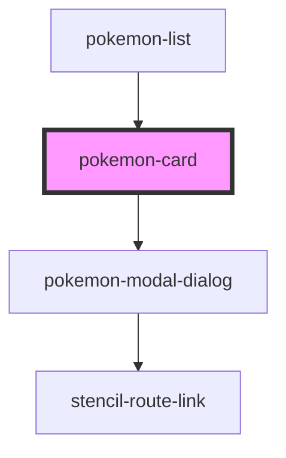

# pokemon-card

<!-- Auto Generated Below -->

## Properties

| Property      | Attribute      | Description | Type  | Default     |
| ------------- | -------------- | ----------- | ----- | ----------- |
| `language`    | `language`     |             | `any` | `undefined` |
| `literals`    | `literals`     |             | `any` | `undefined` |
| `pokemonName` | `pokemon-name` |             | `any` | `undefined` |

## Events

| Event          | Description | Type                             |
| -------------- | ----------- | -------------------------------- |
| `cardSelected` |             | `CustomEvent<{ pokemon: any; }>` |

## Dependencies

### Used by

 - [pokemon-list](../pokemon-list)

### Depends on

- [pokemon-modal-dialog](../pokemon-modal-dialog)

### Graph

----------------------------------------------

*Built with [StencilJS](https://stenciljs.com/)*
