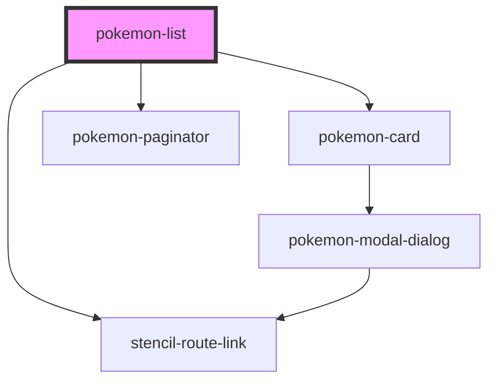

# pokemon-list

<!-- Auto Generated Below -->

## Properties

| Property | Attribute | Description | Type           | Default     |
| -------- | --------- | ----------- | -------------- | ----------- |
| `match`  | --        |             | `MatchResults` | `undefined` |

## Dependencies

### Depends on

- stencil-route-link
- [pokemon-card](../pokemon-card)
- [pokemon-paginator](../paginador)

### Graph

----------------------------------------------

*Built with [StencilJS](https://stenciljs.com/)*
