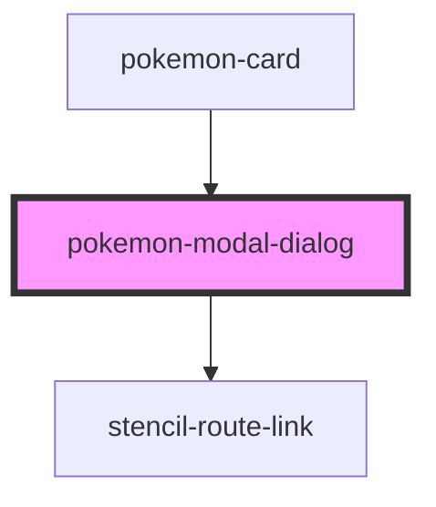

# pokemon-modal-dialog

<!-- Auto Generated Below -->

## Properties

| Property      | Attribute     | Description | Type      | Default     |
| ------------- | ------------- | ----------- | --------- | ----------- |
| `literals`    | `literals`    |             | `any`     | `undefined` |
| `moves`       | --            |             | `Move[]`  | `undefined` |
| `open`        | `open`        |             | `boolean` | `false`     |
| `pokemon`     | `pokemon`     |             | `any`     | `undefined` |
| `titulo`      | `titulo`      |             | `any`     | `undefined` |
| `transparent` | `transparent` |             | `boolean` | `false`     |

## Events

| Event        | Description | Type                   |
| ------------ | ----------- | ---------------------- |
| `modalState` |             | `CustomEvent<boolean>` |

## Dependencies

### Used by

 - [pokemon-card](../pokemon-card)

### Depends on

- stencil-route-link

### Graph

----------------------------------------------

*Built with [StencilJS](https://stenciljs.com/)*
