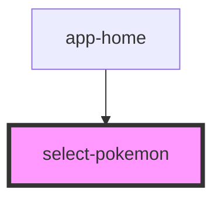

# select-pokemon

<!-- Auto Generated Below -->

## Properties

| Property  | Attribute | Description | Type  | Default     |
| --------- | --------- | ----------- | ----- | ----------- |
| `options` | `options` |             | `any` | `undefined` |
| `titulo`  | `titulo`  |             | `any` | `undefined` |

## Events

| Event         | Description | Type                  |
| ------------- | ----------- | --------------------- |
| `valueSelect` |             | `CustomEvent<string>` |

## Dependencies

### Used by

 - [app-home](../app-home)

### Graph

----------------------------------------------

*Built with [StencilJS](https://stenciljs.com/)*
